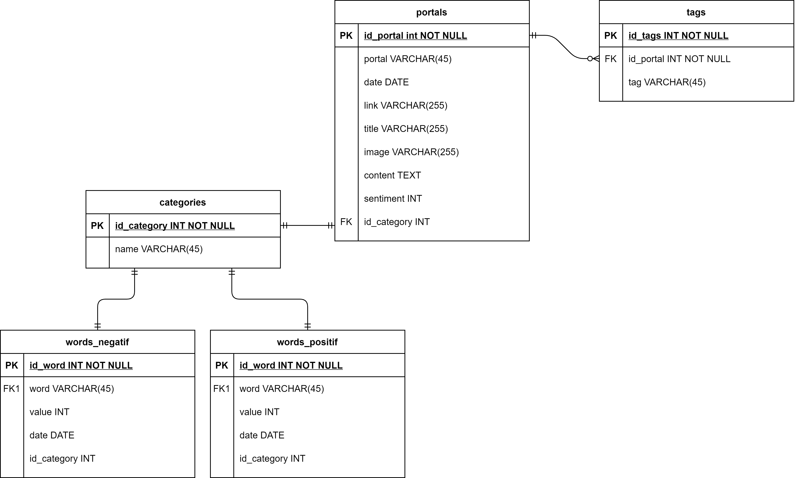

  

# VizNewz
VizNewz is a sentiment analysis app, designed to help government/communities to get the latest trends from a specific region. Currently, we only support getting trends and sentiments from Jakarta as part of the Jakarta Smart City (JSC) program.

## Benefits
For the government:
- Get to know more about the community. VizNews helps the government to learn more about the public's responses to the government policies.
- Improve public services based on news from reputable sources.
- Help the government to base their decisions on data.

For public:
- Easily get the latest news for a specific category.
- Get to know more about the latest government policies and their acceptance in the community based on the results of sentiment analysis.

## How does it work?
Briefly, we perform the following operations:
- Automated News Scraper. We collect news from reputable sources (currently Kompas.com and Detik.com). Our news is updated every 24 hours.
- Jakarta Classification. Classify and filter news that is only related to the Jakarta's government.
- Topic Classification. Classify news into 9 different categories (Transportion, Health, Economy, Culture, Education, Politics, Law, Natural Disaster, and Other).
- Sentiment Analysis. Categorize each news as **positive**, **negative**, and **neutral**. 

You will be able to count sentiments and see the current trends with simple, easy to understand visualization. We also keen to improve our machine learning models to get better accuracy.

## Project Directories
- [VizNewz Android App](https://github.com/oktavian1/VizNewz)
- [VizNewz Backend API](https://github.com/imdar1/news-api)
- [VizNewz Scraper & Predictor](https://github.com/marsathoriq/Scraper-Berita)
- [VizNews ML](https://github.com/marsathoriq/Klasifikasi-Berita)

## Overall Architecture Design

We utilize **Cloud App Engine** for our backend API, connected to the **Cloud SQL** which runs a MySQL instance. The scraper service, deployed on **Cloud Functions**, is a service to scrap news from reputable sources, load machine learning models, perform predict operations, and write the results to the Cloud SQL database. The machine learning models can be found on VizNews ML repo from the [project directory above](#project-directories). We still need to manually deploy the machine learning models to Google Cloud Storage in order to make scraper service runs normally. Cloud Pub/Sub is set as a trigger on the scraper service to integrate it easier with **Cloud Scheduler**.

For the database itself, here is our schema implemented on **Cloud SQL**:

## Team Member
|         Member         | Student ID |         Path         | 
| :--------------------  | :--------: | :------------------: |
|  Ilham Oktovian        |  A3352996  |  Mobile Development  |
|  Erica Rubetta         |  A2342252  |  Mobile Development  |
|  Isa Mujahid D         |  C0020091  |  Cloud Computing     |
|  Nurul Chotimah        |  C1241604  |  Cloud Computing     |
|  Marsa Thoriq Ahmada   |  M0020097  |  Machine Learning      |
|  Ghiffary R            |  M0020052  |  Machine Learning      |
